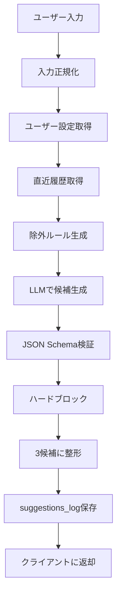

# Webアプリ版 開発指示ドキュメント.md

<aside>
📌

本ドキュメントは、食事提案AIのMVPを **ネイティブアプリではなくWebアプリ / PWA** として開発するための、AIコーディングエージェント向け開発指示書です。Claude Code / Cursor / Devin 等にPhase単位で渡せるMarkdown形式を想定しています。

</aside>

## 0. 前提

### プロダクト概要

- **プロダクト名（仮）**：次に何を食べるか提案AI
- **目的**：日々の食事選びにおける意思決定疲れを減らす
- **提供価値**：時短、節約、栄養の偏り補正、在庫消費、食事のマンネリ回避
- **MVP対象**：個人の日常食。会食・予約・本格的な店舗検索は後回し

### MVPで必ず実現すること

- 最小入力：気分、使える時間、形態（自炊 / 外食 / 買って済ます）
- 任意入力：食の指向、避けたい要素、直近の食事履歴、家にある食材
- 出力：今日の3案
- 各案に表示：所要時間、コスト感、栄養タグ、理由1行
- 選択後：買い物リスト、3ステップ手順、または栄養補完セット
- ログ：入力条件、提案、採択、やり直しを保存

### MVPではやらないこと

- ネイティブアプリ開発
- App Store / Google Play 配布
- 厳密な栄養計算
- 本格的な店舗検索、予約、混雑推定
- 食材写真入力
- 重いパーソナライズ推薦

---

## 1. 技術スタック

### フロントエンド

- **Next.js**
- **TypeScript strict mode**
- **React**
- **Tailwind CSS**
- **PWA対応**
    - ホーム画面追加
    - Web App Manifest
    - アイコン設定
    - 最低限のオフライン表示

### バックエンド

- 第一候補：**Next.js Route Handlers / Server Actions**
- DB / Auth：**Supabase**
- デプロイ：**Vercel**
- 代替候補：Cloudflare Pages + Workers

### DB / 認証

- **Supabase Postgres**
- **Row Level Security 有効**
- **Supabase Auth**
    - Googleログイン
    - メールリンクログイン
    - Appleログインは必要になったら追加

### AI

- OpenAI / Anthropic / Gemini のいずれか
- LLMプロバイダは抽象化し、差し替え可能にする
- LLM出力は必ずJSONで受け取る
- UI用の文章整形はフロントエンド側で行う

### 分析

- MVP初期：Supabaseにイベントログ保存
- 必要に応じてPostHogを追加

---

## 2. リポジトリ構成

```
next-meal-ai/
  app/
    page.tsx
    layout.tsx
    suggest/
      page.tsx
    history/
      page.tsx
    api/
      suggest/
        route.ts
      accept/
        route.ts
  components/
    meal/
    ui/
  lib/
    supabase/
    llm/
    rules/
    analytics/
  config/
    prompts/
    rules/
  types/
    meal.ts
    db.ts
  supabase/
    migrations/
  public/
    icons/
    manifest.webmanifest
  tests/
    unit/
    e2e/
  .env.example
  README.md
```

---

## 3. データモデル

### `preferences`

ユーザーの嗜好、NG、アレルギーを保存する。

```sql
create table preferences (
  user_id uuid primary key references auth.users(id) on delete cascade,
  likes jsonb not null default '[]'::jsonb,
  dislikes jsonb not null default '[]'::jsonb,
  allergies jsonb not null default '[]'::jsonb,
  dietary_restrictions jsonb not null default '[]'::jsonb,
  updated_at timestamptz not null default now()
);
```

### `meals_log`

採択された食事履歴を保存し、被り回避に使う。

```sql
create table meals_log (
  id uuid primary key default gen_random_uuid(),
  user_id uuid not null references auth.users(id) on delete cascade,
  name text not null,
  category text not null,
  form text not null,
  eaten_at timestamptz not null default now(),
  created_at timestamptz not null default now()
);
```

### `suggestions_log`

提案リクエスト、候補、採択結果を保存する。

```sql
create table suggestions_log (
  id uuid primary key default gen_random_uuid(),
  user_id uuid references auth.users(id) on delete set null,
  input jsonb not null,
  normalized_input jsonb,
  excluded_rules jsonb not null default '[]'::jsonb,
  candidates jsonb not null,
  accepted_candidate_id text,
  latency_ms integer,
  created_at timestamptz not null default now()
);
```

### `events_log`

分析イベントを保存する。

```sql
create table events_log (
  id uuid primary key default gen_random_uuid(),
  user_id uuid references auth.users(id) on delete set null,
  event_name text not null,
  properties jsonb not null default '{}'::jsonb,
  created_at timestamptz not null default now()
);
```

### 食カテゴリ

```tsx
export const MEAL_CATEGORIES = [
  'curry_stew',
  'noodle',
  'fried',
  'donburi',
  'ethnic',
  'bread',
  'light_snack',
  'grilled_meat',
  'fish',
  'salad',
  'rice_set',
  'soup',
  'convenience',
  'other',
] as const;
```

---

## 4. 提案エンジン設計

### 基本方針

- **ルールで守るもの**：NG、アレルギー、宗教制約、直近の被り回避
- **LLMに任せるもの**：候補生成、理由文、手順の短文化、代替案
- **最終チェック**：LLM出力後に必ずハードブロックを通す

### 処理フロー



### API入力

`POST /api/suggest`

```json
{
  "mood": "sappari",
  "time_min": 20,
  "form": "cook",
  "free_text": "東南アジア気分。辛いものは苦手。昨日カレーを食べた。",
  "budget_band": "mid"
}
```

### API出力

```json
{
  "suggestion_log_id": "uuid",
  "excluded_reasons": [
    "辛いものNGのため、麻辣・キムチ・辛口カレーを除外",
    "直近でカレーを食べているため、curry_stewを除外"
  ],
  "candidates": [
    {
      "id": "c_1",
      "name": "鶏むねとレモンのさっぱりフォー風スープ",
      "category": "noodle",
      "form": "cook",
      "time_min": 20,
      "cost_band": "mid",
      "nutrition_tags": ["高たんぱく", "さっぱり", "野菜追加可"],
      "reason": "東南アジア気分を満たしつつ、辛さを避けて軽く食べられるため。",
      "ingredients": ["鶏むね肉", "米麺", "レモン", "もやし", "鶏がらスープ"],
      "steps": [
        "鶏むね肉を茹でてスープを作る",
        "米麺ともやしを加えて温める",
        "レモンを搾って仕上げる"
      ],
      "shopping_list": ["米麺", "レモン"]
    }
  ]
}
```

---

## 5. 画面設計

### `/`

ホーム画面。

- 気分：さっぱり / こってり / 辛い / 甘い
- 時間：10分 / 20分 / 40分
- 形態：自炊 / 外食 / 買って済ます
- 任意入力：自由記述
- CTA：`今日の3案を出す`

### `/suggest`

提案結果画面。

- 3候補カード
- 各カードに表示：
    - メニュー名
    - 所要時間
    - コスト感
    - 栄養タグ
    - 理由1行
- アクション：
    - `これにする`
    - `やり直す`
    - `条件を変える`

### `/history`

履歴画面。

- 採択済みの食事一覧
- カテゴリ表示
- 次回の被り回避に使われることを明示

### `/settings`

設定画面。

- 好きなもの
- 苦手なもの
- アレルギー
- 宗教・制約
- 保存ボタン

---

## 6. Phase別 開発指示

## Phase 0：Webアプリ初期セットアップ

### 目的

Next.jsベースの開発環境を作り、型安全・Lint・デプロイ可能な土台を整える。

### タスク

- Next.js + TypeScript プロジェクト作成
- Tailwind CSS導入
- ESLint / Prettier設定
- `.env.example` 作成
- Vercelデプロイ設定
- PWA用manifestとアイコン設定

### 完了条件

- `pnpm dev` でローカル起動できる
- `pnpm lint` が通る
- `pnpm typecheck` が通る
- Vercel preview deploymentが成功する

### エージェント向けプロンプト

```markdown
あなたは熟練のTypeScript / Next.jsエンジニアです。
食事提案AIのWebアプリMVPを開発します。

まずPhase 0として、以下を実装してください。

- Next.js + TypeScript strict mode
- Tailwind CSS
- ESLint / Prettier
- pnpm前提
- .env.example作成
- PWA用 manifest.webmanifest と基本アイコン設定
- Vercelにデプロイしやすい構成

完了条件：
- pnpm devで起動
- pnpm lintが通る
- pnpm typecheckが通る
- READMEにセットアップ手順を書く
```

---

## Phase 1：Supabase DB / Auth構築

### 目的

ユーザー設定、食事履歴、提案ログを保存できる状態にする。

### タスク

- Supabaseクライアント設定
- Auth導入
- migrations作成
- RLS設定
- DB型定義生成

### 完了条件

- ログイン / ログアウトが動く
- `preferences` を自分のユーザーだけ読み書きできる
- `meals_log` に採択履歴を保存できる
- `suggestions_log` に提案ログを保存できる

### エージェント向けプロンプト

```markdown
Phase 1としてSupabase DB / Authを実装してください。

作成するテーブル：
- preferences
- meals_log
- suggestions_log
- events_log

要件：
- Supabase Authを導入
- Googleログインとメールリンクログインを想定
- 全ユーザーデータにRLSを設定
- user_id = auth.uid() のデータのみ読み書き可能
- Supabase型定義を生成し、TypeScriptから利用可能にする

完了条件：
- ログイン / ログアウトが動く
- 自分のpreferencesを保存できる
- RLSにより他ユーザーのデータを読めない
```

---

## Phase 2：提案エンジン API

### 目的

入力から3つの食事候補を返すAPIを作る。

### タスク

- `POST /api/suggest` 実装
- 入力バリデーション
- LLMプロバイダ抽象化
- 入力正規化
- ルールフィルタ
- JSON Schema / Zod検証
- フォールバック候補
- `suggestions_log` 保存

### 完了条件

- APIが3候補を返す
- 辛いNGなら辛い候補が出ない
- 直近履歴と同カテゴリが出にくくなる
- LLM失敗時にフォールバックが返る

### エージェント向けプロンプト

```markdown
Phase 2として、食事提案APIを実装してください。

エンドポイント：
POST /api/suggest

入力：
- mood
- time_min
- form
- free_text
- budget_band

処理：
1. zodで入力検証
2. free_textを構造化する
3. preferencesと直近meals_logを取得
4. NG、アレルギー、直近カテゴリから除外ルールを作る
5. LLMに候補3件をJSONで生成させる
6. zodで出力検証
7. LLM出力後にハードブロックを通す
8. suggestions_logに保存
9. 候補3件を返す

LLMが失敗した場合は、安全なテンプレ候補から3件返してください。
```

---

## Phase 3：ホーム / 提案結果UI

### 目的

ユーザーが最小入力から3案を見て、1つ選べる状態にする。

### タスク

- ホームフォーム
- 提案中ローディング
- 提案結果カード
- 除外理由表示
- 採択ボタン
- 再提案ボタン

### 完了条件

- ホームから3案表示まで動く
- `これにする` で採択できる
- 採択時に `meals_log` が保存される
- エラー時に再試行できる

### エージェント向けプロンプト

```markdown
Phase 3として、Web UIを実装してください。

画面：
- / : ホーム入力画面
- /suggest : 提案結果画面

要件：
- 気分、時間、形態を3タップ以内で入力できる
- 自由記述は任意
- 提案生成中はスケルトンUI
- 3候補カードを表示
- 各カードに、名前、所要時間、コスト感、栄養タグ、理由1行を表示
- 除外理由を小さく表示
- 「これにする」で採択し、meals_logへ保存
- 「やり直す」で再提案

デザインはモバイルファースト、余白広め、落ち着いた配色にしてください。
```

---

## Phase 4：設定画面

### 目的

嗜好、NG、アレルギーをユーザーが保存できるようにする。

### タスク

- `/settings` 作成
- 好きなもの入力
- 苦手なもの入力
- アレルギー入力
- 宗教・制約入力
- Supabase保存

### 完了条件

- 設定が保存される
- 次回提案に設定が反映される
- アレルギー食材が候補に出ない

### エージェント向けプロンプト

```markdown
Phase 4として設定画面を実装してください。

画面：
/settings

保存項目：
- 好きな食材・料理
- 苦手な食材・料理
- アレルギー
- 宗教・その他制約

要件：
- preferencesテーブルに保存
- 保存後、/api/suggestで必ず参照
- アレルギーはハードブロックとして扱う
- 未ログイン時はログイン導線を表示
```

---

## Phase 5：履歴 / 被り回避

### 目的

直近の食事履歴を使い、同じ系統の食事が続かないようにする。

### タスク

- `/history` 作成
- 採択履歴一覧
- 直近3食カテゴリ取得
- 除外緩和ルール
- 除外理由のUI表示

### 完了条件

- 採択履歴が見える
- 直近カテゴリが次回提案に反映される
- 候補が足りない場合は除外を緩める

### エージェント向けプロンプト

```markdown
Phase 5として履歴と被り回避を実装してください。

要件：
- /historyでmeals_logを一覧表示
- /api/suggestでは直近3食のcategoryを取得
- 同カテゴリを原則除外
- ただし候補が3件未満になる場合は、アレルギー以外の除外を段階的に緩める
- excluded_reasonsとして、何を除外したかAPIレスポンスに含める
- UIに「昨日カレーだったため除外」などを表示
```

---

## Phase 6：ログ / 分析

### 目的

MVP改善に必要なイベントを収集する。

### イベント

- `suggestion_requested`
- `suggestion_shown`
- `suggestion_accepted`
- `reroll_clicked`
- `constraint_applied`
- `suggestion_failed`

### 完了条件

- 主要イベントが `events_log` に保存される
- 採択率、やり直し率をSQLで確認できる

### エージェント向けプロンプト

```markdown
Phase 6としてイベントログを実装してください。

要件：
- lib/analytics/track.ts を作成
- MVPではSupabase events_logへ保存
- 開発環境ではconsoleにも出力
- 以下イベントを記録
  - suggestion_requested
  - suggestion_shown
  - suggestion_accepted
  - reroll_clicked
  - constraint_applied
  - suggestion_failed
- 採択率とやり直し率を確認できるSQLビューを作成
```

---

## Phase 7：品質保証 / ガードレール

### 目的

アレルギーや強いNGを必ず守る。

### タスク

- LLM出力後のハードブロック
- 禁止食材辞書
- 辛いNGの拡張定義
- 回帰テスト
- E2Eテスト

### 完了条件

- 甲殻類NGでエビ・カニが出ない
- 辛いNGでキムチ・麻辣・辛口カレーが出ない
- テストがCIで通る

### エージェント向けプロンプト

```markdown
Phase 7として品質保証とガードレールを実装してください。

要件：
- LLM出力後に必ずハードブロックを実行
- allergiesに一致するingredientsを含む候補は除外
- dietary_restrictionsも同様に除外
- 「辛いNG」には、キムチ、麻辣、辛口カレー、激辛、唐辛子多めを含める
- 候補が不足した場合は安全なテンプレ候補で補填
- tests/unitに20件の回帰テストを作成
- Playwrightで主要導線のE2Eテストを作成
```

---

## Phase 8：クローズドβ公開

### 目的

5〜10人がスマホブラウザで使える状態にする。

### タスク

- Vercel本番デプロイ
- 独自ドメイン設定
- Basic認証または招待制ログイン
- プライバシーポリシー作成
- フィードバックフォーム作成
- PWA挙動確認

### 完了条件

- テスターがURLから利用できる
- スマホでホーム画面追加できる
- フィードバックを収集できる
- 主要イベントが記録される

### エージェント向けプロンプト

```markdown
Phase 8としてクローズドβ公開準備をしてください。

要件：
- Vercel本番デプロイ
- 環境変数をproduction用に設定
- Basic認証または招待制ログインで限定公開
- privacy-policy.mdを作成
- フィードバックフォームへの導線を設置
- PWAとしてスマホのホーム画面に追加できることを確認
- 本番環境で主要イベントがevents_logに保存されることを確認
```

---

## 7. 品質基準

### UI

- モバイルファースト
- 片手で操作しやすい
- 最小入力は3タップ以内
- 文字量は少なく、理由は1行
- ローディング中に不安を与えない

### AI出力

- 必ずJSON
- 必ず3候補
- 必ず理由1行
- 必ず所要時間とコスト感を含める
- アレルギー・NGは最終出力で必ず除外

### セキュリティ

- APIキーはサーバ側のみ
- RLS必須
- 他ユーザーの履歴を読めない
- LLMに送る情報は必要最小限

### テスト

- ユニットテスト：ルール、正規化、ハードブロック
- APIテスト：`/api/suggest`
- E2E：入力 → 提案 → 採択
- 回帰テスト：NG / アレルギー / 被り回避

---

## 8. 成功指標

### MVP定量指標

- 提案採択率：50%以上
- やり直し率：30%未満
- 入力所要時間：10秒未満
- 提案API成功率：95%以上

### MVP定性指標

- 入力が面倒ではない
- 提案理由が納得できる
- 「今日これでいい」と思える
- 同じような食事が続きにくい

---

## 9. 実装時の注意

- LLMにすべて任せない
- 除外ロジックは必ず決定論的に実装する
- アレルギーは「お願い」ではなく「ハードブロック」
- Markdown整形をLLMに任せない
- JSON Schema / Zod検証を必ず通す
- 失敗時のフォールバックを必ず用意する
- 最初からネイティブアプリ化しない
- PWAで検証し、需要が見えたらネイティブ化を再検討する

---

## 10. 今後の拡張候補

- Google Places APIによる店舗候補
- 食材写真入力
- 栄養DB連携
- カレンダー連携による食事タイミング推定
- 通知 / リマインド
- 家族向け複数人設定
- サブスク課金
- ネイティブアプリ化